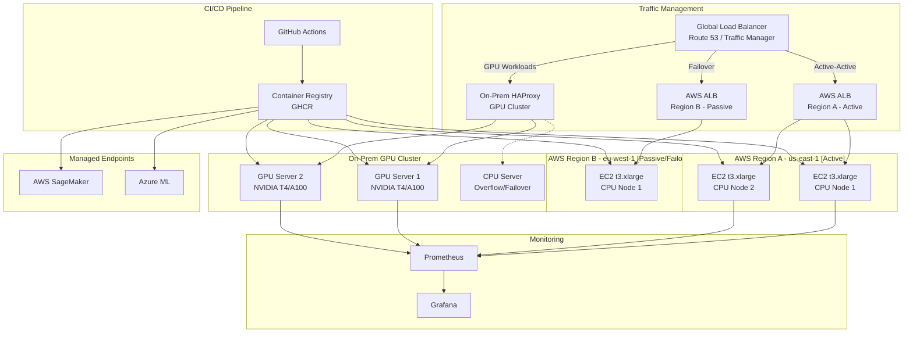
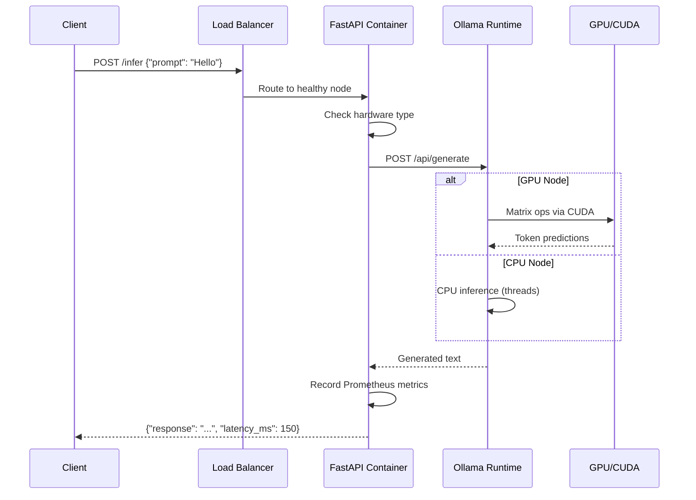

# Architecture

## System Overview

The Multi-Architecture LLM Deployment Pipeline deploys a containerized Large Language Model (LLM) inference service across heterogeneous infrastructure: AWS cloud VMs, Azure VMs, on-premises GPU servers, and managed AI endpoints. A single Docker image runs everywhere without modification.

## Architecture Diagram

## Sequence Diagram — Inference Request

## Multi-Region Traffic Patterns

### Active-Active (AWS Region A)
- Both nodes in Region A receive traffic simultaneously
- ALB distributes requests with health-check-based routing
- Used for: production traffic, low-latency serving

### Active-Passive (AWS Region B)
- Region B runs but receives no traffic unless Region A fails
- Route 53 health checks trigger DNS failover
- Used for: disaster recovery, compliance (EU data residency)

### On-Prem GPU Cluster
- Primary inference for latency-sensitive or data-sovereign workloads
- HAProxy load-balances across GPU nodes
- CPU node serves as overflow when GPU capacity is saturated

## Component Responsibilities

| Component | Responsibility | Why It Exists |
|-----------|---------------|---------------|
| FastAPI | HTTP API, health checks, metrics | Standard REST interface for any client |
| Ollama | LLM runtime, model loading, inference | Portable model format, CPU/GPU auto-detect |
| Docker | Containerization | Same image everywhere, dependency isolation |
| Terraform | Infrastructure provisioning | Version-controlled, repeatable infra |
| Ansible | Host configuration | Idempotent setup of Docker, NVIDIA, CUDA |
| Prometheus | Metrics collection | Industry-standard monitoring |
| Grafana | Dashboards and alerting | Visualize deployment health |
| GitHub Actions | CI/CD orchestration | Automated build-test-deploy pipeline |
