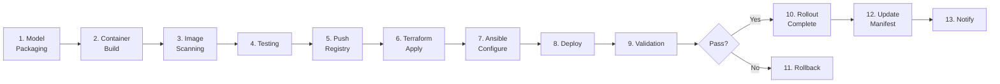

# Deployment Flow

## Pipeline Stages

Every deployment follows these standardized stages regardless of target.

## Stage-by-Stage Explanation

### Stage 1: Model Packaging
**What:** Create a model manifest describing the LLM (name, version, size, hardware requirements).
**Why:** Models are large (1-70GB). Packaging defines what gets deployed without bundling the model into the image.
**How:** `scripts/package-model.sh` generates `model-packages/model-manifest.json`.
**Where:** CI job `package-model` in `.github/workflows/ci.yml`.

### Stage 2: Container Build
**What:** Build the Docker image containing FastAPI + Ollama runtime.
**Why:** Containerization ensures identical runtime across all targets. "Build once, deploy anywhere."
**How:** `docker/Dockerfile` multi-stage build. Ollama binary copied from official image.
**Where:** CI job `docker-build`.

### Stage 3: Image Scanning
**What:** Scan container image and filesystem for known vulnerabilities (CVEs).
**Why:** Security gate — prevents deploying images with critical vulnerabilities.
**How:** Trivy scans for CRITICAL/HIGH severity issues. Pipeline fails on CRITICAL.
**Where:** CI jobs `security-scan` and `push-registry`.

### Stage 4: Testing
**What:** Run unit tests against the FastAPI application.
**Why:** Catch regressions before building/deploying the container.
**How:** `pytest tests/` validates endpoints, request validation, metrics.
**Where:** CI job `unit-test`.

### Stage 5: Push to Registry
**What:** Push the scanned image to GitHub Container Registry (GHCR).
**Why:** Central artifact store. All deployment targets pull the same image.
**How:** `docker/build-push-action` tags with git SHA and `latest`.
**Where:** CI job `push-registry` (main branch only).

### Stage 6: Terraform Apply
**What:** Provision infrastructure (VMs, networking, firewalls, storage, load balancers).
**Why:** Infrastructure as Code — reproducible, auditable, version-controlled.
**How:** `terraform apply` in the target environment directory.
**Where:** Deploy workflows, job `terraform-apply`.

### Stage 7: Ansible Configuration
**What:** Configure the provisioned hosts (Docker, NVIDIA drivers, CUDA, deploy container).
**Why:** Terraform creates machines; Ansible makes them ready to run the LLM.
**How:** `ansible-playbook playbooks/site.yml` with hardware-specific roles.
**Where:** Deploy workflows, job `ansible-configure`.

### Stage 8: Deploy
**What:** Pull the container image and start the LLM service.
**Why:** Rolling deployment — one node at a time to minimize downtime.
**How:** `scripts/rollout.sh` deploys and validates each node sequentially.
**Where:** Deploy workflows, job `deploy`.

### Stage 9: Validation
**What:** Run automated inference prompts and check health, latency, model availability.
**Why:** Deployment must not succeed if the model cannot serve requests.
**How:** `scripts/validate-deployment.sh` sends "Hello", "What is Kubernetes?", "What is AI?".
**Where:** Deploy workflows, job `validate`. **Pipeline fails if validation fails.**

### Stage 10: Rollout Complete
**What:** All nodes deployed and validated.
**Why:** Confirms the new version is live across the target.

### Stage 11: Rollback (on failure)
**What:** Revert to the previous known-good deployment.
**Why:** Automatic recovery when validation or deployment fails.
**How:** `scripts/rollback.sh` reads previous manifest and re-deploys.
**Where:** Triggered automatically by `rollout.sh` on failure.

### Stage 12: Update Manifest
**What:** Generate JSON deployment manifest with metadata.
**Why:** Audit trail, rollback reference, deployment history.
**How:** `scripts/generate-manifest.sh` creates timestamped JSON in `manifests/`.
**Where:** Deploy workflows, job `update-manifest`.

### Stage 13: Notify
**What:** Send deployment success/failure notification.
**Why:** Team awareness of deployment state.
**How:** GitHub Actions notification step (extend with Slack/PagerDuty).

## Target-Specific Workflows

| Workflow | Target | Trigger | Key Differences |
|----------|--------|---------|-----------------|
| `deploy-cloud-vm.yml` | AWS/Azure VMs | Manual dispatch | Terraform + ALB + CPU/GPU choice |
| `deploy-managed-endpoint.yml` | SageMaker/Azure ML | Manual dispatch | Managed scaling, no VM management |
| `deploy-onprem-gpu.yml` | On-prem GPU cluster | Manual dispatch | NVIDIA/CUDA setup, GPU layers config |
