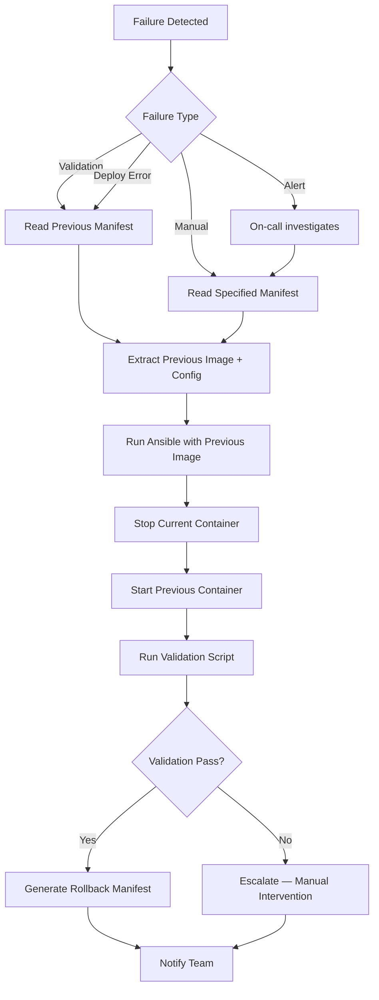

# Rollback Flow

## When Rollback Triggers

1. **Validation failure** — inference prompts fail or latency exceeds threshold
2. **Deployment failure** — container fails to start on any node during rolling deploy
3. **Manual trigger** — operator runs `scripts/rollback.sh <manifest-id>`
4. **Alert-driven** — Prometheus alert `LLMModelUnavailable` fires for 2+ minutes

## Rollback Sequence



## Rollback Commands

```bash
# List available manifests
ls manifests/

# Rollback to specific deployment
./scripts/rollback.sh aws-region-a-production-2026-06-09T12:00:00Z

# Automatic rollback during failed rollout
# (triggered by rollout.sh — no manual action needed)
```

## Manifest-Based Rollback

Each deployment manifest in `manifests/` contains:

```json
{
  "container_image": "ghcr.io/org/multi-arch-llm-pipeline:abc123",
  "model_version": "abc123",
  "hardware_type": "gpu",
  "rollback": {
    "previous_manifest": "aws-region-a-production-2026-06-08T10:00:00Z",
    "rollback_command": "./scripts/rollback.sh aws-region-a-production-2026-06-09T12:00:00Z"
  }
}
```

The `previous_manifest` field creates a chain of deployments for traceability.

## Rolling Deploy Safety

`scripts/rollout.sh` implements safe rolling deployment:

1. Deploy to Node 1 → validate → proceed
2. Deploy to Node 2 → validate → proceed
3. If Node 2 fails → rollback ALL nodes to previous manifest
4. This ensures you never have a mixed state where some nodes run the broken version

## Blue-Green Alternative

For zero-downtime rollback in production:

1. Deploy new version to "green" environment
2. Run validation against green
3. Switch load balancer traffic from blue to green
4. If issues arise, switch back to blue instantly (DNS/LB change only)

The current implementation uses rolling deploy (simpler for VM-based targets). Blue-green can be added via separate target groups in Terraform ALB configuration.
